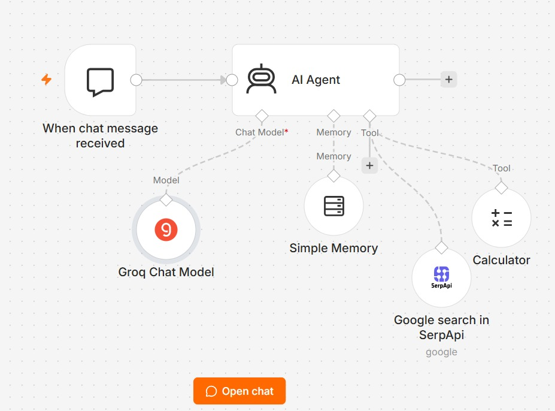

# 🤖 AI Web Search Agent

An AI-powered web search agent built using **n8n**, **Groq**, and **SerpAPI**.

The agent can understand user queries, perform web searches when required, carry out calculations, and maintain short-term conversation context using memory.

## 🚀 Features

* 🤖 **AI Agent** — Handles user queries and decides which tool to use.
* 🧠 **Groq LLM** — Provides the language model powering the agent.
* 🔎 **SerpAPI Google Search** — Allows the agent to search the web for relevant and up-to-date information.
* 🧮 **Calculator Tool** — Performs mathematical calculations.
* 💾 **Simple Memory** — Maintains short-term conversation context.
* 💬 **Chat Trigger** — Allows users to interact with the agent through chat.

## 🛠️ Workflow

```text
User
  ↓
Chat Trigger
  ↓
AI Agent
  ├── Groq Chat Model
  ├── Simple Memory
  ├── Google Search (SerpAPI)
  └── Calculator
```

## ⚙️ Tech Stack

| Technology   | Purpose                                        |
| ------------ | ---------------------------------------------- |
| n8n          | Workflow automation and AI agent orchestration |
| Groq         | Large Language Model                           |
| Qwen 3.6 27B | AI model used by the agent                     |
| SerpAPI      | Google web search                              |
| n8n Memory   | Short-term conversation memory                 |

## 📂 Project Structure

```text
AI-Web-Search-Agent/
│
├── workflow.json
└── README.md
```

## 🔧 Setup

### 1. Install / Open n8n

Create or open an n8n instance.

### 2. Import the workflow

Import `workflow.json` into n8n.

### 3. Configure Groq

Add your own Groq API credentials to the **Groq Chat Model** node.

### 4. Configure SerpAPI

Add your own SerpAPI credentials to the **Google Search in SerpApi** node.

### 5. Run the workflow

Start the workflow and interact with the AI Agent through the chat interface.

## 💡 Example Queries

Try queries such as:

```text
Search the web for the latest AI news.

Find the best restaurants in Hyderabad.

What are the latest developments in generative AI?

Calculate 25% of 18,500.

Search Google for the current price of a particular product.
```

For queries requiring current or external information, the AI Agent can use the **SerpAPI Google Search tool**.

## 🔐 Security

API credentials are **not included** in this repository.

You must provide your own:

* Groq API key
* SerpAPI key

**Never commit API keys, passwords, tokens, or other secrets to GitHub.**

## 📸 Workflow Preview

Add a screenshot of your n8n workflow here:


## 📸 Workflow Preview


## 🎯 Purpose

This project demonstrates how to build a tool-using AI agent with n8n that can combine:

**LLM reasoning + web search + calculations + conversation memory**

It is designed as a practical example of integrating generative AI with external tools and workflow automation.


